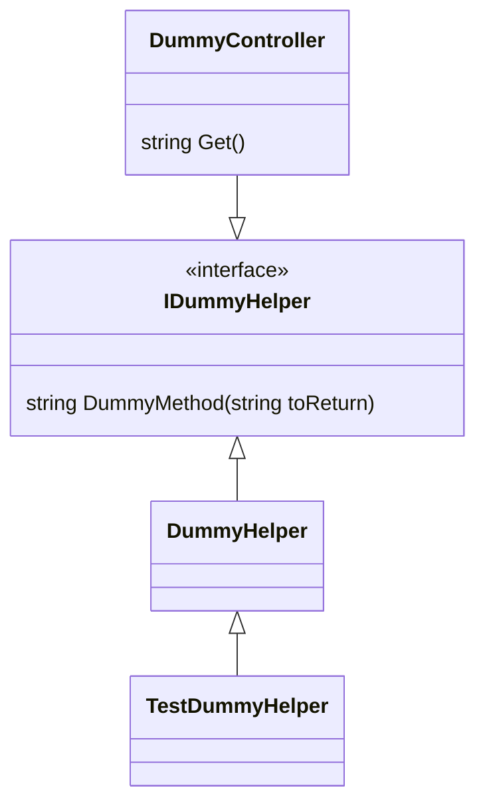

# Integration Tests on .NET 6

This repository demonstrates how a test class can extend an application class to provide mock parameters. The classes are related as follow:

Refer to [DummyHelper.cs](Api/DummyHelper.cs), [TestDummyHelper.cs](ApiTest/TestDummyHelper.cs) & the [test file](ApiTest/DummyTest.cs) for more details. One caveat is that `DummyHelper.DummyMethod(string toReturn)` requires the `virtual` modifier for `TestDummyHelper` to override.
